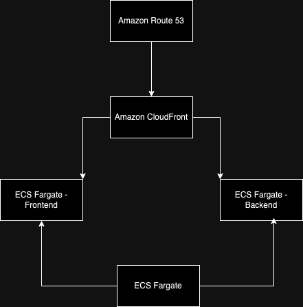

# Conception d'une infrastructure sur AWS

Félicitations ! Vous venez de terminer de développer votre nouvelle app (révolutionnaire à n'en point douter) et n'êtes qu'à un déploiement sur AWS d'une longue vie remplie de gloire et de richesses.

Pour y parvenir, vous venez de créer et d'uploader deux images Docker des composants de votre app, appellées **backend** et **frontend** (partez du principe que cette étape est déjà réalisée). Votre application étant révolutionnaire, ces deux images constituent l'intégralité de ce que vous avez à déployer. 

Il ne vous reste plus qu'à designer votre infrastructure et le tour est joué !
Cette tâche peut se décomposer en trois parties 

1. Sélectionner les composants AWS dont vous aurez besoin pour déployer votre app. *(indice: Lisez votre cours et la documentation AWS)*
2. Créer un schéma décrivant l'infrastructure que vous allez déployer *(indice: https://aws.amazon.com/fr/what-is/architecture-diagramming/)*
3. Justifier vos choix techniques (il faut bien convaincre vos futurs investisseurs !)
4. Bonus: Indiquez quel service AWS vous avez utilisé pour uploader vos images Docker et les rendre disponibles dans votre projet AWS

**EXEMPLES DE SCHÉMAS**
- https://farzanaafrintisha.medium.com/basics-of-aws-architecture-diagram-278563b9cfd1
- https://developerck.com/aws-architecture-diagrams/
- https://docs.aws.amazon.com/whitepapers/latest/web-application-hosting-best-practices/an-aws-cloud-architecture-for-web-hosting.html

**CONTRAINTES**
- Vous n'êtes pas à l'aise avec l'administration d'infrastructure, vous opterez donc pour une solution **managée** et **serverless**
- Vous souhaitez que votre application soit déployée sur **deux zones** afin de prévenir à tout désastre naturel pouvant frapper les serveurs (même Jeff Bezos ne peut rien face au dérèglement climatique)

**RENDU**
1. Créez un fichier foad_<nom1>_<nom_2>.md dans votre fork
2. Répondez aux questions et insérez votre schéma dans ce fichier
3. Commitez et pushez ce fichier

Pour insérer une image dans un fichier markdown
https://stackoverflow.com/questions/41604263/how-do-i-display-local-image-in-markdown
https://marinegeo.github.io/2018-08-10-adding-images-markdown/

## Reponse

# 1. Sélection des composants AWS

Pour déployer notre application web comprenant un **frontend** et un **backend** en utilisant des services managés et sans serveur, voici les composants choisis :

- **Amazon Elastic Container Service (ECS) avec Fargate** : Ce service permet de déployer nos conteneurs Docker sans gérer les serveurs en arrière-plan. Fargate prend en charge l’infrastructure sous-jacente, simplifiant ainsi l'administration.

- **Amazon CloudFront** : Ce service de distribution de contenu rapproche les données des utilisateurs, ce qui permet de réduire les temps de chargement si l’application prend de l’ampleur.

- **Amazon Route 53** : Service DNS qui gère le nom de domaine de notre application, redirigeant le trafic utilisateur vers les bonnes zones AWS et facilitant la configuration d’un domaine personnalisé.

# 2. Schéma d’infrastructure

# 3. Justification des choix

Ces choix techniques permettent une approche **serverless** (ECS avec Fargate pour éviter la gestion directe des serveurs) et **managée**. En optant pour une infrastructure multi-zone, on réduit les risques de panne en cas d’indisponibilité d’un data center.

- **Fargate** : Simplifie la gestion des conteneurs en évitant la configuration manuelle des serveurs.
- **CloudFront** : Assure des performances optimales en rapprochant les contenus de nos utilisateurs.
- **Route 53** : Simplifie la configuration du domaine et le routage, ce qui est pratique pour gérer le trafic de manière fluide.

# 4. Bonus : Service pour stocker les images Docker

Pour rendre nos images Docker disponibles dans AWS, on utilise **Amazon Elastic Container Registry (ECR)**, un dépôt d’images Docker sécurisé et intégré avec ECS, ce qui facilite le déploiement.
